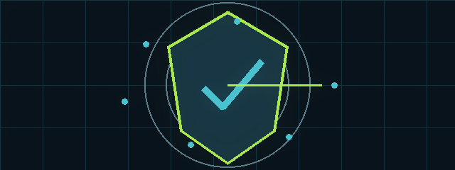

  

<h1 align="center">let-me-kick</h1>

<strong>A wireless-security research prototype concerned with client-disconnection scenarios and their operational impact.</strong>

<code>REPO//SIGNAL</code> · <code>SHIELD / RESEARCH</code> · <code>LOOPING README EXPERIENCE</code>

## Live signal

| Lens | Readout |
| --- | --- |
| Portfolio lane | **SHIELD / RESEARCH** |
| Code surface | **6** tracked files observed |
| Primary materials | **Markdown, Shell** |
| Verification | **3** test-related files observed |

> A responsible, controlled view of security-sensitive work. The animated frame above is a lightweight visual signature; the sections below remain the source of truth for implementation details.

## Motion map

`OBSERVE` → `BOUND` → `IMPROVE`

Read this project as a controlled research artifact. Establish authorization first, isolate the environment, inspect the implementation, and keep defensive outcomes measurable. Do not use real credentials, third-party networks, or unapproved systems.

<strong>Open the full project dossier</strong>

> A wireless-security research prototype concerned with client-disconnection scenarios and their operational impact.

## Overview

The project contains code that can interfere with wireless connectivity, making it unsuitable for ordinary networks or unapproved environments.

## Security research context

Its most appropriate use is defensive research: understanding disconnection indicators, strengthening wireless monitoring, and testing incident-response controls in a fully isolated lab.

## Repository review

Review the source code, configuration files, and project notes before making any change. The implementation should be assessed for clear authorization boundaries, audit logging, input validation, safe failure behaviour, and documentation that distinguishes research-only concepts from production-ready features.

## Safe evaluation approach

Perform review only in an isolated environment that you own or are formally authorized to administer. Establish the scope and success criteria in writing, avoid using real credentials or personal data, keep the test environment segregated from production traffic, and stop immediately if behaviour extends beyond the approved boundary.

## Defensive improvement opportunities

- Add an explicit authorization gate and clear non-production defaults.
- Add structured audit logging and a documented incident-response path.
- Build a safe simulation or dry-run mode for contributors and reviewers.
- Add automated tests that verify guardrails and expected failure behaviour.
- Document defensive detections, mitigations, and remediation guidance alongside the research concepts.

## Contributing

Contributions should prioritize safety, defensive value, maintainability, and clear documentation. Do not add features that increase operational misuse potential. Propose changes through issues or pull requests with a description of the intended defensive outcome and the test boundary used for validation.

---

README motion system · visual layer by RepoSignal · implementation details remain project-specific

